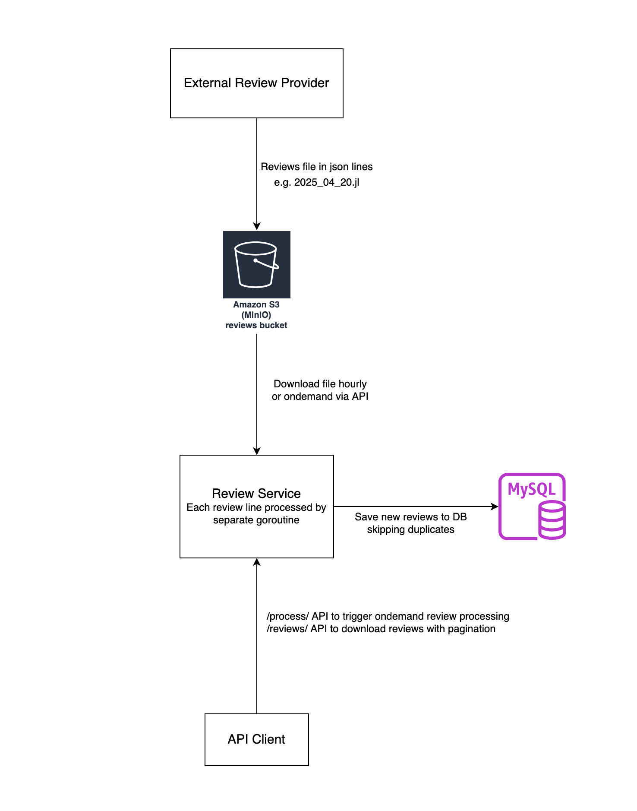

# Review System Microservices

## Project Overview
A go application to process hotel reviews uploaded to S3 in json lines format.

### Performance
This service creates one goroutine per review json which is responsible for DB insertion.

### Validation
It validates for mandatory fields to be non-empty and then checks duplicate review using __HotelReviewId__ and __ProviderId__ combined uniqueness. Duplicate records are skipped with a log entry.

### API Support
This application runs an api server using gorrilla/mux on port 8080.

It supports two APIs
1. http://127.0.0.1:8080/reviews/?page=1

    It returns 100 latest reviews and supports pagination starting from page=1
1. http://127.0.0.1:8080/process/

    This triggers ondemand review processing from S3.

### Error handling and logging
1. All operations are checked for error and suitable message is logged without application crashing
1. Open files and resources are closed using defer to prevent memory leaks

## Project setup
### This project uses docker compose to create 3 containers
1. __review__: go application with cron and api support
1. __minio__: To test S3 locally.
1. __mysql__: Database running on port 3306.

### Installation
```bash
git clone https://github.com/drawinkumar/review-service.git
cd review-service
docker compose up --build
```

### S3 bucket setup
1. Bucket name is set in __compose.yml__ env variable (S3_BUCKET) default: __reviews__
1. The service expects new review files to uploaded to S3 bucket root directory
1. Expected reviews json lines filename: YYYY_MM_DD.jl, e.g. 2025_04_20.jl
1. Example file is included [sample/2025_04_20.jl](sample/2025_04_20.jl)
1. AWS credentials need to be updated in __compose.yml__ if minio is not used

## Architecture

